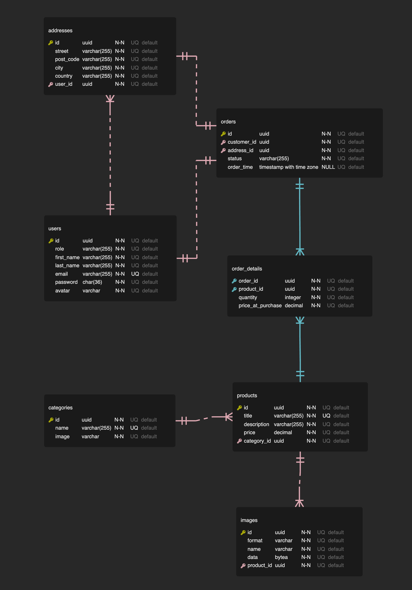

# Fullstack Project - Server


This is the server side repository for the Fullstack Project of Integrify Academy Fullstack Program 2023 - August.

## Table of Contents

1. [Technologies](#Technologies)
2. [Structures](#structures)
3. [Entity Relational Design](#entity-relational-design)
4. [Architecture](#architecture)
5. [Features](#features)
   - [Public features](#public-features)
   - [Customer features](#customer-features)
   - [Admin features](#admin-features)
6. [Requirements](#requirements)
7. [Getting Started](#getting-started)
8. [Testing](#testing)

## Technologies

- C#
- ASP.NET Core 7
- Entity Framework Core
- PostgreSQL

## Structures

```
├── Shopify.Controller
    ├── src
        └── Controller
├── Shopify.Core
    ├── src
        ├── Abstraction
        ├── Entity
        └── Shared
├── Shopify.Service
    ├── src
        ├── Abstractions
        ├── DTO
        ├── Service
        └── Shared
├── Shopify.Test
    ├── src
        └── Shared
└── Shopify.WebAPI
    ├── src
        ├── Authorization
        ├── Database
        ├── MiddleWare
        ├── Repository
        └── Service
```

## Entity Relational Design



## Architecture

This project is developed following clean architecture. It ensures system is more scalable for future enhancement and maintainability. It consist of

- WebAPI Layer
- Controller Layer
- Service Layer
- Core Layer

## Features

### Public features

- View all categories
- View all products
- Register as a customer
- Login

### Customer features

- Update own profile
- Update own password
- CRUD order belongs to itself (Update only allowed paid, cancel, return)
- CRUD address belongs to itself
- Delete its own account

### Admin features

- CRUD category
- CRUD product
- Create user as customer/admin
- Get all users info
- Delete user
- Get all orders info
- Update order status to (delivering, delivered)

## Getting Started

1. Make sure you have necessary packages installed locally
2. Clone this repository
3. Prepare your PostgreSQL database locally or remotely
4. Modify your `appsettings.json` under `Shopify.WebAPI` folder according to the instruction of `Shopify.WebAPI/appsettings_example.json`
5. Run `dotnet ef migrations add Initial` under `Shopify.WebAPI` folder
6. Run `dotnet ef database update` under `Shopify.WebAPI` folder
7. Rund `dotnet watch` under `Shopify.WebAPI` folder

## Testing

Run the command `dotnet test` under the Shopify.Test folder
